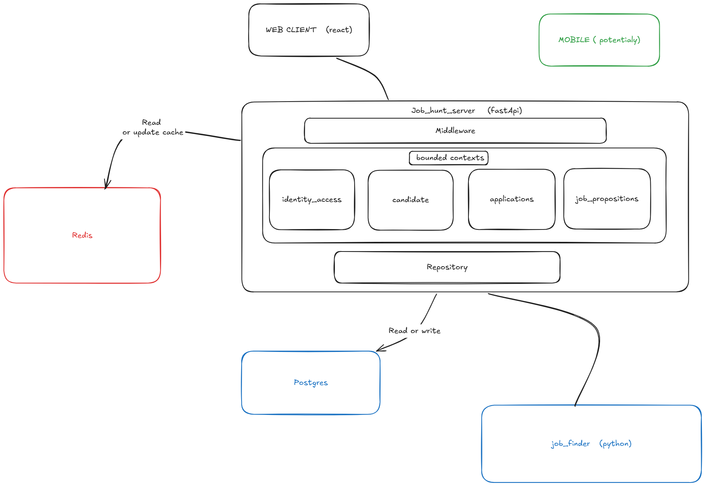

# ADR 001: Initial architecture

**Status:** Accepted  
**Date:** 2026-10-09

## Decision

Build Job Hunt OS as a React client backed by one FastAPI modular monolith.

FastAPI contains four modules:

- `identity_access` — accounts, authentication, authorization, Google connection.
- `candidate` — profile, search preferences, target countries, CVs and CV versions.
- `applications` — application pipeline, contacts, follow-ups and approved Gmail drafts.
- `job_propositions` — collected job offers, source links, matching, saved and dismissed offers.

PostgreSQL is the source of truth. Redis is only for cache and short-lived operational data.

The existing Python job finder stays a separate worker. It finds and normalizes offers, then sends them to the `job_propositions` module. It does not own user or application data.

Gmail remains an adapter inside `applications`, not a separate service. Creating a draft or sending mail always requires user approval.

## Consequences

- We keep one API and one database for now; bounded contexts are code boundaries, not microservices.
- Each module owns its own repositories and rules, even while using the same PostgreSQL instance.
- An application can reference a candidate, CV version and job offer by ID, but it does not own or modify them.
- The mobile client, AI provider, exact worker scheduling and internal hexagonal design are intentionally undecided.
